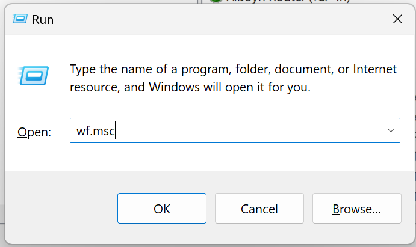
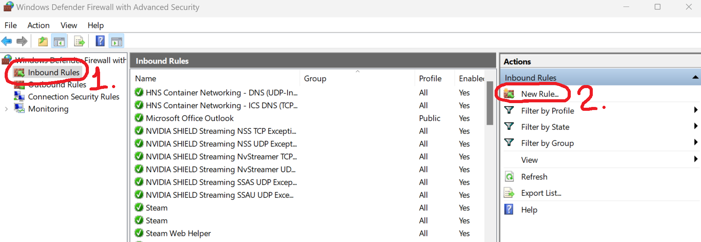
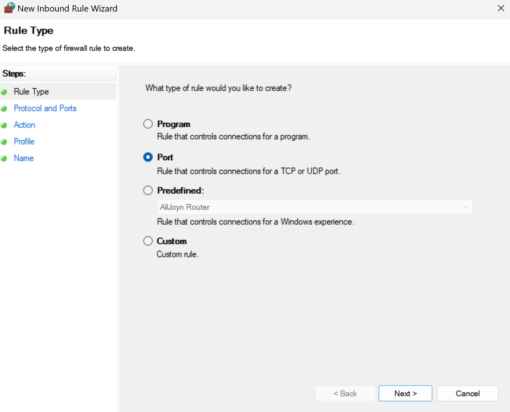
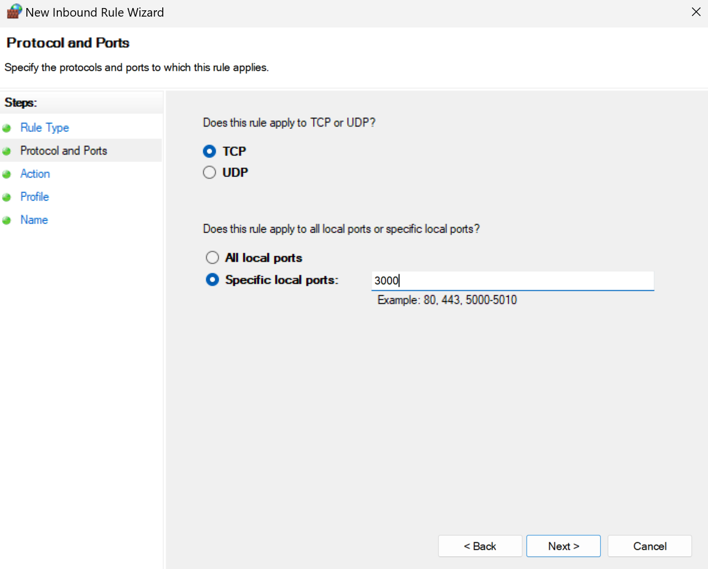
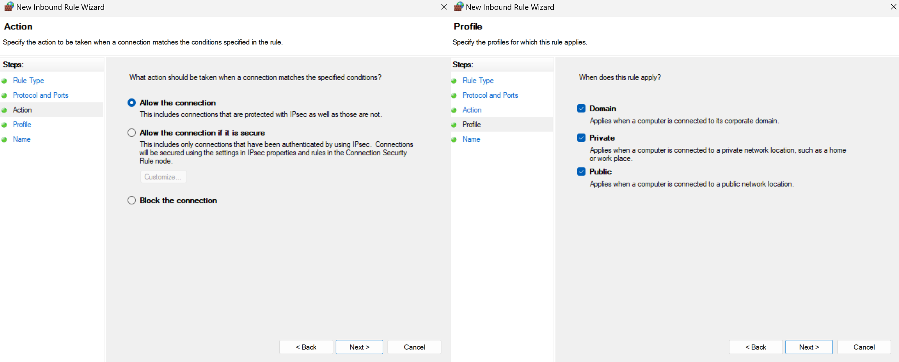
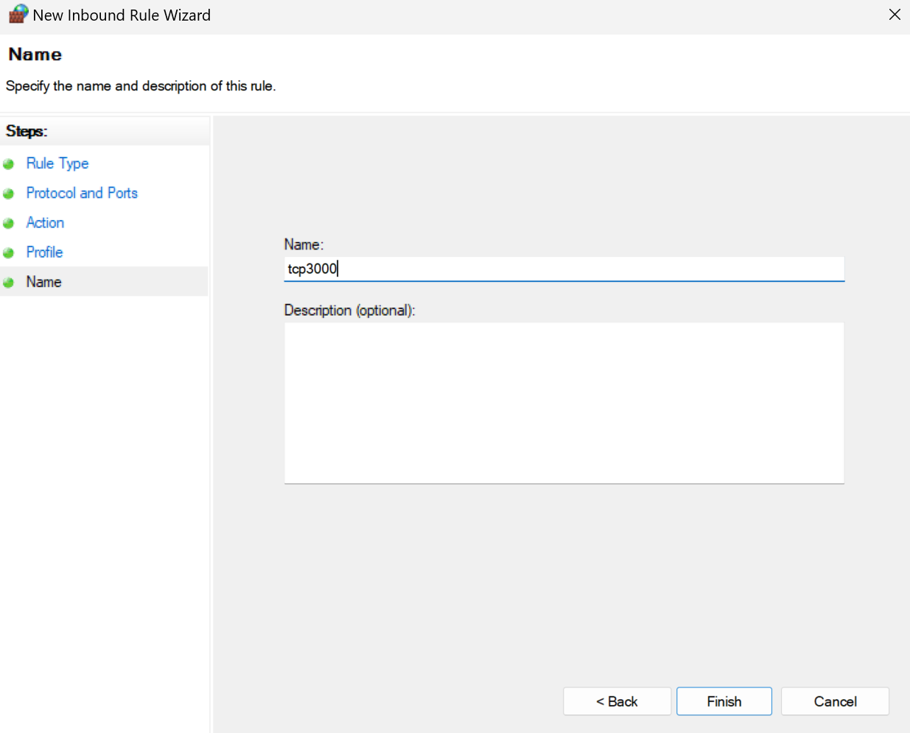

### How to access localhost running in **wsl** from your local network

Open **Windows Defender Firewall with Advanced security**

Press `Win + R` and run `wf.msc`



---

Click on `Inbound rules`, then on `New rule...`



---

Now for the **New Inbound Rule Wizard**:


**1.** For **Rule Type** select `Port` and press `Next`


**2.** For **Protocols and Ports** specify the port(s) you want to expose and press `Next`


**3.** For **Action** and **Profile** just keep everything as is and press `Next`


**4.** For **Name** add a suitable name for the rule and press `Finish`

---

Get your **wsl** hostname with

```powershell
wsl hostname -I
# 172.X.X.X
```

And replace it, along with the desired port, in the following command

```powershell
netsh interface portproxy add v4tov4 listenport=$PORT listenaddress=0.0.0.0 connectport=$PORT connectaddress=$HOSTNAME
```

Finally, find the **Wireless LAN Adapter** `IPv4 Address` using

```powershell
ipconfig
# IPv4 Address. . . : 192.168.X.X
```

Now to access on another device in your network, just use `192.168.X.X:$PORT` (**IPv4** from `ipconfig` and **desired port**)

---

This is not an original guide, just an adaptation containing only the necessary steps with no additional information.

For more details regarding some of the steps, you can check the original guide.

Source: https://medium.com/codemonday/access-wsl-localhost-from-lan-for-mobile-testing-8635697f008
